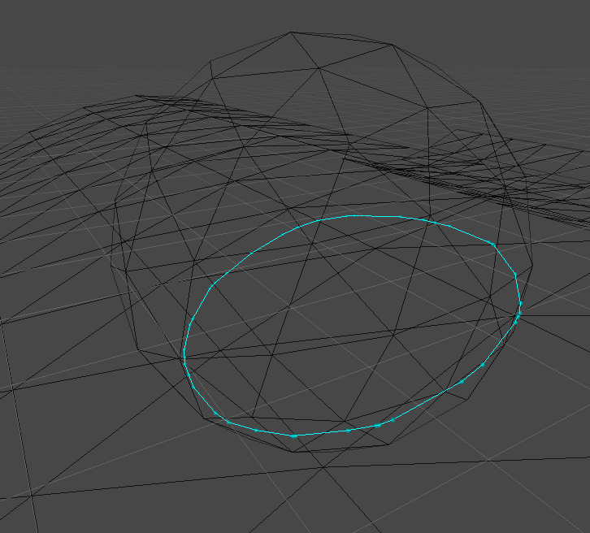
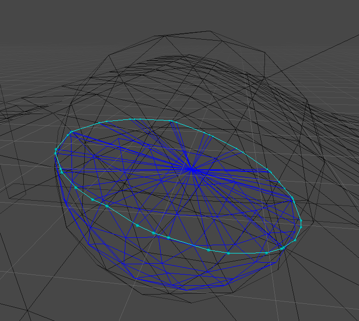

# Buoyancy simulation

This is a simulation of the buoyancy on mesh objects. This method is applicable to any mesh to simulate a floating behaviour. This method works for a moving water surface.

    

# The method

To simulate the buoyancy, we need to apply two forces, the gravity at the center of mass and the buoyant force at the geometric center of the immersed part of the object and oriented toward the normal of the water surface.

To find the immersed part of the mesh, we compute the intersection between the water mesh and the floating object's mesh. The intersection finding is based on [1], this allows to find an accurate chain of points that are exactly at the intersection.

    

From this chain, we can get the triangles of the floating mesh that are bellow the water line and we can triangulate the chain to have the surface of the displaced water.

    

We then compute the goemetric center and the volume of the intersection mesh [2].

# Performances

This algorithm is more computationaly expensive than some simpler approximations. To improve performance, part of the algorithm is parralelized on the GPU. With the sphere and 20\*20 water, it runs at 30fps in the Unity Editor.

# References

-   [1] S. H. Lo and W. X. Wang. 2004. A fast robust algorithm for the intersection of triangulated surfaces. Eng. with Comput. 20, 1 (March 2004), 11–21.
-   [2] Cha Zhang and Tsuhan Chen, "Efficient feature extraction for 2D/3D objects in mesh representation," Proceedings 2001 International Conference on Image Processing (Cat. No.01CH37205), 2001, pp. 935-938 vol.3, doi: 10.1109/ICIP.2001.958278.
